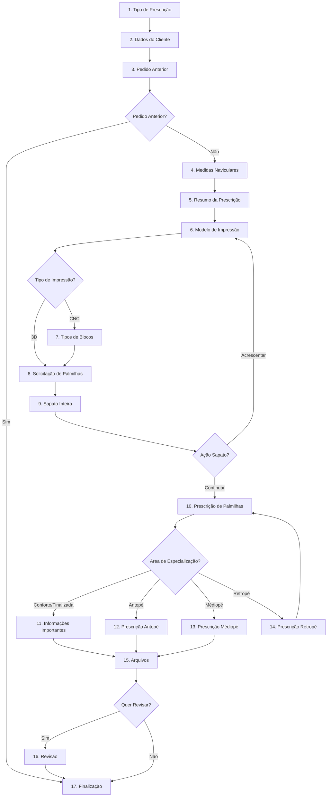

# 🏗️ Arquitetura das Etapas - SOS Palmilhas

Este documento detalha a arquitetura do sistema de etapas do formulário multi-step, incluindo padrões, estruturas e navegação inteligente.

## 📋 Visão Geral do Sistema

O sistema de etapas é composto por **até 17 etapas** dinâmicas, onde o fluxo é determinado pelas escolhas do usuário. O sistema utiliza TypeScript rigoroso, validação Zod e navegação inteligente.

### 🎯 Princípios Arquiteturais

- **Tipagem Rigorosa**: Cada etapa possui interface TypeScript específica
- **Navegação Inteligente**: Fluxos condicionais baseados nas escolhas do usuário
- **Componentes Reutilizáveis**: Padrões consistentes entre todas as etapas
- **Validação Zod**: Validação runtime e compiletime integrada
- **Estado Centralizado**: Gerenciamento via `useFormState` hook customizado

## 🗺️ Fluxo Completo das Etapas



## 📁 Estrutura de Arquivos

```
src/components/steps/
├── index.ts                           # 🎯 Exports centralizados
├── common/                            # 🧩 Componentes reutilizáveis
│   ├── InputField.tsx                # ⚡ Campo input padronizado
│   ├── ProgressBar.tsx               # 📊 Barra de progresso
│   ├── StepNavigation.tsx            # 🧭 Navegação entre etapas
│   └── StepWrapper.tsx               # 📦 Wrapper padrão para etapas
├── form-steps/                        # 📋 Etapas específicas do formulário
│   ├── PatientPrescriptionTypeStep.tsx    # 1️⃣ Tipo de Prescrição
│   ├── PersonalInfoStep.tsx               # 2️⃣ Dados do Cliente
│   ├── PreviousOrderStep.tsx              # 3️⃣ Pedido Anterior
│   ├── FootMeasurementsStep.tsx           # 4️⃣ Medidas Naviculares
│   ├── SummaryStep.tsx                    # 5️⃣ Resumo da Prescrição
│   ├── CustomizationStep.tsx              # 6️⃣ Modelo de Impressão
│   ├── BlockTypeStep.tsx                  # 7️⃣ Tipos de Blocos
│   ├── InsoleRequestStep.tsx              # 8️⃣ Solicitação de Palmilhas
│   ├── SapatoInteiraStep.tsx              # 9️⃣ Sapato Inteira
│   ├── PalmilhaPrescriptionStep.tsx       # 🔟 Prescrição de Palmilhas
│   ├── ImportantInfoStep.tsx              # 1️⃣1️⃣ Informações Importantes
│   ├── AntepePrescriptionStep.tsx         # 1️⃣2️⃣ Prescrição Antepé
│   ├── MediopePrescriptionStep.tsx        # 1️⃣3️⃣ Prescrição Médiopé
│   ├── RetropePrescriptionStep.tsx        # 1️⃣4️⃣ Prescrição Retropé
│   ├── FilesStep.tsx                      # 1️⃣5️⃣ Arquivos
│   ├── ReviewStep.tsx                     # 1️⃣6️⃣ Revisão
│   ├── FinalizeStep.tsx                   # 1️⃣7️⃣ Finalização
│   ├── PaymentStep.tsx                    # 💳 Pagamento (futuro)
│   └── SymptomsStep.tsx                   # 🏥 Sintomas (futuro)
├── hooks/                             # 🎣 Hooks específicos
│   └── useStepValidation.ts          # ✅ Validação de etapas
└── utils/                             # 🛠️ Utilitários
    └── formatters.ts                  # 🔧 Formatadores e validações

src/types/
├── form.ts                            # 📝 Interfaces de dados (17 tipos)
├── steps.ts                           # 📝 Interfaces de etapas
├── index.ts                           # 🎯 Exports centralizados
└── pagarme.d.ts                       # 📝 Tipos do Pagar.me
```

## 🔗 Definições de Tipos

### FormStep (Union Type)

```typescript
export type FormStep =
  | "prescription" // 1. Tipo de Prescrição
  | "client-data" // 2. Dados do Cliente
  | "previous-order" // 3. Pedido Anterior
  | "navicular-measurement" // 4. Medidas Naviculares
  | "prescription-summary" // 5. Resumo da Prescrição
  | "printing-model" // 6. Modelo de Impressão
  | "block-type" // 7. Tipos de Blocos
  | "insole-request" // 8. Solicitação de Palmilhas
  | "sapato-inteira" // 9. Sapato Inteira
  | "palmilha-prescription" // 10. Prescrição de Palmilhas
  | "important-info" // 11. Informações Importantes
  | "antepe-prescription" // 12. Prescrição Antepé
  | "mediope-prescription" // 13. Prescrição Médiopé
  | "retrope-prescription" // 14. Prescrição Retropé
  | "files" // 15. Arquivos
  | "review" // 16. Revisão
  | "finalize"; // 17. Finalização
```

### Interfaces de Dados

O arquivo `src/types/form.ts` contém **17 interfaces** específicas:

```typescript
// Principais interfaces de dados
export interface PrescriptionData { ... }       // Etapa 1
export interface ClientData { ... }             // Etapa 2
export interface PreviousOrderData { ... }      // Etapa 3
export interface NavicularMeasurementData { ... } // Etapa 4
export interface PrescriptionSummaryData { ... } // Etapa 5
export interface PrintingModelData { ... }      // Etapa 6
export interface BlockTypeData { ... }          // Etapa 7
export interface InsoleRequestData { ... }      // Etapa 8
export interface SapatoInteiraData { ... }      // Etapa 9
export interface PalmilhaPrescriptionData { ... } // Etapa 10
export interface ImportantInfoData { ... }      // Etapa 11
export interface AntepePrescriptionData { ... } // Etapa 12
export interface MediopePrescriptionData { ... } // Etapa 13
export interface RetropePrescriptionData { ... } // Etapa 14
export interface FilesData { ... }              // Etapa 15
export interface ReviewData { ... }             // Etapa 16
export interface FinalizeData { ... }           // Etapa 17

// Interface principal que agrega todos os dados
export interface FormData {
  prescription: PrescriptionData;
  clientData: ClientData;
  previousOrder: PreviousOrderData;
  navicularMeasurement: NavicularMeasurementData;
  prescriptionSummary: PrescriptionSummaryData;
  printingModel: PrintingModelData;
  blockType: BlockTypeData;
  insoleRequest: InsoleRequestData;
  sapatoInteira: SapatoInteiraData;
  palmilhaPrescription: PalmilhaPrescriptionData;
  importantInfo: ImportantInfoData;
  antepePrescription: AntepePrescriptionData;
  mediopePrescription: MediopePrescriptionData;
  retropePrescription: RetropePrescriptionData;
  files: FilesData;
  review: ReviewData;
  finalize: FinalizeData;
}
```

## 🧩 Componentes Base

### StepWrapper

Componente base que padroniza o layout de todas as etapas:

```tsx
interface StepWrapperProps {
  title: string;
  subtitle?: string;
  icon?: string;
  children: React.ReactNode;
  showProgress?: boolean;
  currentStep?: number;
  totalSteps?: number;
}

// Uso
<StepWrapper
  title="Prescrição de Antepé"
  subtitle="Selecione os pontos de alívio"
  icon="🦶"
>
  {/* Conteúdo da etapa */}
</StepWrapper>;
```

### StepNavigation

Componente para navegação entre etapas com suporte a navegação inteligente:

```tsx
interface StepNavigationProps {
  currentStepIndex: number;
  totalSteps: number;
  onStepClick: (stepIndex: number) => void;
  completedSteps: boolean[];
  steps: FormStep[];
  // Props opcionais para compatibilidade
  onNext?: () => void;
  onPrev?: () => void;
  nextLabel?: string;
  prevLabel?: string;
  canProceed?: boolean;
  isLoading?: boolean;
}
```

### BaseStepProps

Interface base que todas as etapas devem implementar:

```tsx
interface BaseStepProps<T = Record<string, unknown>> {
  data: T;
  onUpdate: (data: Partial<T>) => void;
  onNext?: () => void;
  onPrev?: () => void;
}

// Exemplo de implementação
export function MinhaEtapa({
  data,
  onDataChange,
  onNext,
  onPrev,
}: BaseStepProps<MinhaData> & {
  onDataChange: (data: MinhaData) => void;
}) {
  // Implementação da etapa
}
```

## 🔄 Sistema de Navegação Inteligente

### Navegação Condicional

O sistema utiliza funções específicas para navegação customizada:

```tsx
// No MultiStepForm.tsx

// Navegação do Pedido Anterior
const handlePreviousOrderNavigation = () => {
  if (formData.previousOrder.isPreviousOrder === "yes") {
    goToStep("finalize"); // Pula direto para finalização
  } else {
    nextStep(); // Continua fluxo normal
  }
};

// Navegação do Sapato Inteira
const handleSapatoInteiraNavigation = () => {
  if (formData.sapatoInteira.nextAction === "acrescentar") {
    goToStep("printing-model"); // Volta para impressão
  } else {
    nextStep(); // Continua para palmilhas
  }
};

// Navegação do Retropé
const handleRetropePrescriptionNavigation = () => {
  goToStep("palmilha-prescription"); // Volta para seleção de área
};

// Navegação de Volta da Finalização
const handleFinalizeStepBack = () => {
  if (formData.previousOrder.isPreviousOrder === "yes") {
    goToStep("previous-order");
  } else if (formData.palmilhaPrescription.selectedArea === "antepe") {
    goToStep("antepe-prescription");
  } else {
    prevStep();
  }
};
```

### Lógica de Etapas Dinâmicas

O hook `useFormState` determina dinamicamente quais etapas mostrar:

```tsx
const getSteps = useCallback(
  (): FormStep[] => {
    const baseSteps: FormStep[] = ["prescription"];

    if (formData.prescription.prescriptionType === "individual") {
      baseSteps.push(
        "client-data",
        "previous-order",
        "navicular-measurement",
        "prescription-summary",
        "printing-model"
      );

      // Adiciona tipos de blocos apenas para CNC
      if (formData.printingModel.modelType === "cnc") {
        baseSteps.push("block-type");
      }

      baseSteps.push("insole-request");

      if (formData.insoleRequest.insoleType) {
        baseSteps.push("sapato-inteira", "palmilha-prescription");

        // Ramificação baseada na área selecionada
        if (
          formData.palmilhaPrescription.selectedArea === "conforto" ||
          formData.palmilhaPrescription.selectedArea === "finalizada"
        ) {
          baseSteps.push("important-info");
        } else if (formData.palmilhaPrescription.selectedArea === "antepe") {
          baseSteps.push("antepe-prescription");
        } else if (formData.palmilhaPrescription.selectedArea === "mediope") {
          baseSteps.push("mediope-prescription");
        } else if (formData.palmilhaPrescription.selectedArea === "retrope") {
          baseSteps.push("retrope-prescription");
        }

        baseSteps.push("files");

        // Adiciona revisão ou finalização baseado na escolha
        if (formData.files.wantToReview === "yes") {
          baseSteps.push("review");
        } else if (formData.files.wantToReview === "no") {
          baseSteps.push("finalize");
        }
      }
    }

    return baseSteps;
  },
  [
    /* dependências das condições */
  ]
);
```

## 📊 Estados e Validação

### Estados das Etapas

Cada etapa pode estar em um dos seguintes estados:

- **Pendente**: Ainda não visitada
- **Ativa**: Atualmente sendo preenchida
- **Completada**: Preenchida e validada
- **Com Erro**: Contém dados inválidos

### Sistema de Validação

```tsx
// Validação com Zod (preparado para implementação)
const stepSchema = z.object({
  field1: z.string().min(1, "Campo obrigatório"),
  field2: z.email("Email inválido"),
  // ... outros campos
});

// Hook de validação
const useStepValidation = <T,>(schema: z.ZodSchema<T>) => {
  const [errors, setErrors] = useState<Record<string, string>>({});

  const validate = useCallback(
    (data: T) => {
      const result = schema.safeParse(data);
      if (!result.success) {
        const newErrors: Record<string, string> = {};
        result.error.errors.forEach((error) => {
          newErrors[error.path[0]] = error.message;
        });
        setErrors(newErrors);
        return false;
      }
      setErrors({});
      return true;
    },
    [schema]
  );

  return { errors, validate };
};
```

## 🎨 Padrões de Design

### Iconografia

Cada etapa possui um emoji específico para identificação visual:

- 🩺 Tipo de Prescrição
- 👤 Dados do Cliente
- 📝 Pedido Anterior
- 👣 Medidas Naviculares
- 📊 Resumo da Prescrição
- 🖨️ Modelo de Impressão
- 🧱 Tipos de Blocos
- 🦶 Solicitação de Palmilhas
- 👞 Sapato Inteira
- 🩺 Prescrição de Palmilhas
- ℹ️ Informações Importantes
- 🦶 Prescrições Especializadas (Antepé/Médiopé/Retropé)
- 📁 Arquivos
- 🔍 Revisão
- ✅ Finalização

### Layout Responsivo

Todas as etapas seguem um padrão responsivo consistente:

```tsx
<div className="container mx-auto px-4 max-w-6xl">
  <StepNavigation ... />
  <div className="bg-white rounded-lg shadow-lg p-6 md:p-8">
    <StepWrapper ...>
      {/* Conteúdo específico da etapa */}
    </StepWrapper>
  </div>
</div>
```

## 🔄 Ciclo de Vida das Etapas

### 1. Inicialização

- Carregamento dos dados iniciais
- Definição das etapas dinâmicas
- Configuração do estado

### 2. Navegação

- Validação antes de avançar
- Atualização do estado global
- Marcação de etapas como completadas

### 3. Atualização

- Modificação dos dados da etapa
- Revalidação em tempo real
- Sincronização com estado global

### 4. Finalização

- Validação final de todos os dados
- Preparação para submissão
- Limpeza de recursos

## 🚀 Extensibilidade

### Adicionando Nova Etapa

1. **Criar Interface de Dados**:

```tsx
// src/types/form.ts
export interface NovaEtapaData {
  campo1: string;
  campo2: number;
  // ... outros campos
}
```

2. **Adicionar ao FormData**:

```tsx
export interface FormData {
  // ... outras etapas
  novaEtapa: NovaEtapaData;
}
```

3. **Criar Componente da Etapa**:

```tsx
// src/components/steps/form-steps/NovaEtapaStep.tsx
export function NovaEtapaStep({
  data,
  onDataChange,
  onNext,
  onPrev,
}: BaseStepProps<NovaEtapaData> & {
  onDataChange: (data: NovaEtapaData) => void;
}) {
  return (
    <StepWrapper title="Nova Etapa" icon="🆕">
      {/* Implementação */}
    </StepWrapper>
  );
}
```

4. **Adicionar ao FormStep Union Type**:

```tsx
export type FormStep =
  | "prescription"
  // ... outras etapas
  | "nova-etapa";
```

5. **Integrar no MultiStepForm**:

```tsx
case 'nova-etapa':
  return (
    <NovaEtapaStep
      data={formData.novaEtapa}
      onDataChange={(data) => updateFormData('novaEtapa', data)}
      onNext={nextStep}
      onPrev={prevStep}
    />
  );
```

6. **Atualizar Lógica de Etapas**:

```tsx
const getSteps = useCallback(
  () => {
    const baseSteps: FormStep[] = ["prescription"];

    // Adicionar condição para nova etapa
    if (algumaCondicao) {
      baseSteps.push("nova-etapa");
    }

    return baseSteps;
  },
  [
    /* dependências */
  ]
);
```

## 📝 Boas Práticas

### Desenvolvimento

- **Tipagem Rigorosa**: Sempre use TypeScript com interfaces específicas
- **Validação Zod**: Implemente validação para todos os campos críticos
- **Componentes Reutilizáveis**: Use componentes da pasta `common/`
- **Navegação Inteligente**: Implemente lógica condicional quando necessário
- **Estado Imutável**: Use spreads para atualizar dados sem mutação

### Performance

- **Lazy Loading**: Carregue etapas sob demanda quando necessário
- **Memoização**: Use `useMemo` e `useCallback` para otimizar renders
- **Estados Locais**: Mantenha estados específicos da etapa localmente quando possível

### Testes

- **Testes Unitários**: Teste cada etapa individualmente
- **Testes de Integração**: Valide fluxos completos de navegação
- **Testes de Validação**: Confirme que Zod schemas funcionam corretamente

### Documentação

- **Comentários JSDoc**: Documente interfaces e funções complexas
- **README Específicos**: Crie documentação para etapas complexas
- **Exemplos de Uso**: Forneça exemplos de implementação

---

**Esta arquitetura garante escalabilidade, manutenibilidade e consistência no desenvolvimento do sistema de etapas do SOS Palmilhas.**

## 🎣 Hooks Customizados

### useStepValidation

```tsx
const { errors, validate, validateField, hasErrors } =
  useStepValidation(validationSchema);
```

- Hook para gerenciar validação
- Estado de erros por campo
- Validação individual ou completa
- Integração com utilitários de validação

## 🛠️ Utilitários

### Formatters

```typescript
import { formatters } from "../utils/formatters";

// Formatação automática
const cpfFormatted = formatters.cpf("12345678900"); // 123.456.789-00
const phoneFormatted = formatters.phone("11999999999"); // (11) 99999-9999
const currencyFormatted = formatters.currency(5000); // R$ 50,00
```

### Validators

```typescript
import { validators } from "../utils/formatters";

// Validação
const isValidCPF = validators.cpf("123.456.789-00");
const isValidEmail = validators.email("user@example.com");
const isValidPhone = validators.phone("(11) 99999-9999");
```

## 📋 Tipos TypeScript

### BaseStepProps<T>

```typescript
interface BaseStepProps<T> {
  data: T;
  onUpdate: (data: Partial<T>) => void;
  onNext?: () => void;
  onPrev?: () => void;
}
```

### ValidatableStepProps<T>

```typescript
interface ValidatableStepProps<T> extends BaseStepProps<T> {
  errors?: Record<string, string>;
  onValidate?: (data: T) => Record<string, string>;
}
```

### NavigatableStepProps<T>

```typescript
interface NavigatableStepProps<T> extends BaseStepProps<T> {
  canProceed?: boolean;
  isLoading?: boolean;
}
```

## 🎯 Como Criar uma Nova Step

### 1. **Estrutura Básica**

```tsx
"use client";

import { StepWrapper, StepNavigation, InputField } from "../common";
import { BaseStepProps } from "@/types/steps";
import { MyDataType } from "@/types/form";

type MyStepProps = BaseStepProps<MyDataType>;

export function MyStep({ data, onUpdate, onNext, onPrev }: MyStepProps) {
  return (
    <StepWrapper title="Minha Step" subtitle="Descrição da step" icon="🎯">
      <div className="space-y-6">
        <InputField
          label="Campo Exemplo"
          value={data.campo}
          onChange={(e) => onUpdate({ campo: e.target.value })}
          required
        />

        <StepNavigation
          onNext={onNext}
          onPrev={onPrev}
          canProceed={!!data.campo}
        />
      </div>
    </StepWrapper>
  );
}
```

### 2. **Com Validação**

```tsx
import { useStepValidation } from "../hooks/useStepValidation";
import { validators } from "../utils/formatters";

export function MyStepWithValidation({
  data,
  onUpdate,
  onNext,
  onPrev,
}: MyStepProps) {
  const validationSchema = {
    campo: validators.required("Campo é obrigatório"),
    email: validators.email("Email inválido"),
  };

  const { errors, validateField, hasErrors } =
    useStepValidation(validationSchema);

  const handleFieldChange = (field: string, value: string) => {
    onUpdate({ [field]: value });
    validateField(field, value);
  };

  return (
    <StepWrapper title="Com Validação" subtitle="Step com validação" icon="✅">
      <div className="space-y-6">
        <InputField
          label="Campo Obrigatório"
          value={data.campo}
          onChange={(e) => handleFieldChange("campo", e.target.value)}
          error={errors.campo}
          required
        />

        <StepNavigation
          onNext={onNext}
          onPrev={onPrev}
          canProceed={!hasErrors}
        />
      </div>
    </StepWrapper>
  );
}
```

### 3. **Exportar no Index**

```typescript
// src/components/steps/index.ts
export { MyStep } from "./form-steps/MyStep";
export { MyStepWithValidation } from "./form-steps/MyStepWithValidation";
```

## 📝 Padrões de Desenvolvimento

### **Nomenclatura**

- Steps: PascalCase + sufixo "Step" (ex: `PersonalInfoStep`)
- Hooks: camelCase + prefixo "use" (ex: `useStepValidation`)
- Utilitários: camelCase (ex: `formatters`, `validators`)

### **Estrutura de Arquivos**

- Uma step por arquivo
- Imports organizados (externos → internos → relativos)
- Exports nomeados sempre

### **Props e Interfaces**

- Sempre use `BaseStepProps<T>` como base
- Estenda com interfaces específicas quando necessário
- Use generics para tipagem dos dados

### **Validação**

- Use o hook `useStepValidation` para consistência
- Combine com utilitários de validação
- Feedback visual imediato ao usuário

### **Estilização**

- Use Tailwind CSS com classes utilitárias
- Mantenha espaçamento consistente (`space-y-6`)
- Responsividade mobile-first

## 🧪 Testes

### **Estrutura de Testes**

```
__tests__/
├── components/
│   ├── common/
│   │   ├── InputField.test.tsx
│   │   └── StepNavigation.test.tsx
│   └── form-steps/
│       └── PersonalInfoStep.test.tsx
├── hooks/
│   └── useStepValidation.test.tsx
└── utils/
    └── formatters.test.tsx
```

### **Padrões de Teste**

- Testes unitários para utilitários
- Testes de integração para steps
- Testes de acessibilidade
- Mocks para funções de navegação

## 🚀 Status da Reorganização

- [x] Remoção de arquivos desnecessários
- [x] Reorganização da estrutura de pastas
- [x] Criação de componentes comuns
- [x] Criação de utilitários e hooks
- [x] Refatoração da PersonalInfoStep
- [x] Movimentação de tipos para diretório global
- [x] Documentação da nova estrutura
- [x] Validação com lint (sem erros)
- [ ] Refatoração das demais steps
- [ ] Implementação de testes automatizados
- [ ] Componentes adicionais (SelectField, CheckboxField, etc.)

## 🎨 Próximos Passos

### **Componentes Adicionais**

- `SelectField` para dropdowns
- `CheckboxField` para múltipla escolha
- `RadioField` para escolha única
- `FileUpload` para uploads
- `DateField` para datas

### **Melhorias**

- Validação em tempo real mais robusta
- Integração com bibliotecas de formulário (react-hook-form)
- Animações de transição entre steps
- Modo de visualização/preview
- Persistência de dados no localStorage

### **Documentação**

- Storybook para componentes comuns
- Guias de desenvolvimento
- Exemplos práticos
- Best practices

A estrutura agora está sólida e preparada para crescer de forma organizada e consistente! 🎉
